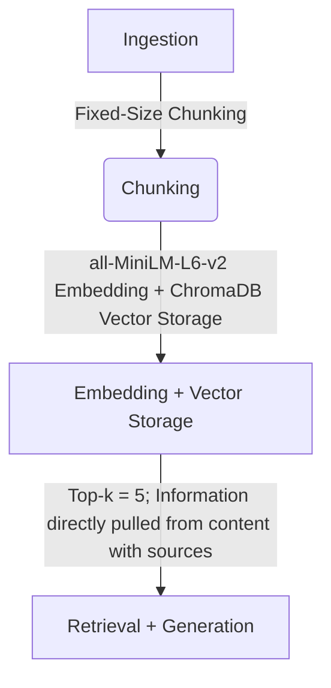

# Project 1 Planning: The Unofficial Guide

> Write this document before you write any pipeline code.
> Your spec and architecture diagram are what you'll use to direct AI tools (Claude, Copilot, etc.) to generate your implementation — the more specific they are, the more useful the generated code will be.
> Update the Retrieval Approach and Chunking Strategy sections if you change your approach during implementation.
> Update this file before starting any stretch features.

---

## Domain

I chose to specalize in my university's on-campus first year housing options because opinions are varied and the official page lists all the options and amenities but nothing about the community experience surrounding each dorm. This combined with not knowing much about the University before attending leads to many not knowing which dormitory would be the best fit for them and what they should put in their rankings for preferred dorm options. 

---

## Documents

<!-- List your specific sources: URLs, subreddit names, forum threads, or file descriptions.
     Aim for at least 10 sources that together cover different subtopics or perspectives within your domain. -->

| # | Source | Description | URL or location |
|---|--------|-------------|-----------------|
| 1 | New Hall Style Dorms| https://housing.virginia.edu/alderman-hall
| 2 | New Suite Style Dorms| https://housing.virginia.edu/alderman-suite
| 3 | Brown Residential Collage | https://housing.virginia.edu/brown
| 4 | Hereford Residential Collage | https://housing.virginia.edu/hereford
| 5 | International Residential Collage | https://housing.virginia.edu/irc
| 6 | Gooch & Dillard Suite Dorm| https://housing.virginia.edu/gooch-dillard
| 7 | Old Dorms | https://housing.virginia.edu/mccormick
| 8 | Forum Discussion | https://www.reddit.com/r/UVA/comments/12y2smz/uva_dorms_ranked/
| 9 | Forum Discussion |https://talk.collegeconfidential.com/t/freshman-dorms/1805679/2
| 10 | Ranking List | https://www.society19.com/ultimate-ranking-of-first-year-dorm-choices-at-uva/
| 11 | Ranking List | https://www.roomsurf.com/dorms-ranked/virginia

---

## Chunking Strategy

<!-- How will you split documents into chunks?
     State your chunk size (in tokens or characters), overlap size, and explain why those
     numbers fit the structure of your documents.
     A review-heavy corpus warrants different chunking than a long FAQ. -->

**Chunk size:**
1000 Characters
**Overlap:**
200 Characters
**Reasoning:**
I mostly have structured pages or forum discussions with structured text that are a max of around 200 words (~ 1000 characters), therefore a fixed size chunking would be better than recursive or semantic chunking because I don't have long text and I also don't have high level seperators in my sources.
---

## Retrieval Approach

<!-- Which embedding model are you using (e.g., all-MiniLM-L6-v2 via sentence-transformers)?
     How many chunks will you retrieve per query (top-k)?
     If you were deploying this for real users and cost wasn't a constraint, what tradeoffs
     would you weigh in choosing a different embedding model — context length, multilingual
     support, accuracy on domain-specific text, latency? -->

**Embedding model:**
all-MiniLM-L6-v2 via sentence-transformers
**Top-k:**
5 Chunks since I need to pull the information about the dorm and the opnions on all the ranking lists. 
**Production tradeoff reflection:**

Given a no cost constraint, I would choose a more domain specific, low context length, high latency, English only embedding model.
I would want a more domain specific model regarding the location and knowing the area better to explain the services and distances to differnt areas. 
I would want a low context length since there are not a lot of specific ideas that need to be linked together, just raw information that must be embedded
I would want high latency, because I care more about the quality of the information then the speed since any general LLM model (i.e. ChatGPT, Gemini) can give generic information about each dorm but not all the nuance. 
Finally, I would choose to have no Multilingual Support because there is only a small population of International Students at my University which would make choosing reducing the efficiency for multiple languages not worth the trade off. 

---

## Evaluation Plan

<!-- List your 5 test questions with their expected correct answers.
     Questions should be specific enough that you can judge whether the system's response
     is right or wrong. "What are good dining halls?" is too vague.
     "What do students say about wait times at [dining hall name] during lunch?" is testable. -->

| # | Question | Expected answer |
|---|----------|-----------------|
| 1 | What is the closest dining hall to Newcomb Dining Hall? | Brown Residential College
| 2 | What is the difference between Residential Colleges and other First-Year Dorm Options? | Res Colleges have students from all years, while First-Year dorms have only First-Year students
| 3 | Which dorms have personal bathrooms (i.e. non communal bathrooms)? Any suite style dorm (Gooch Dillard, Alderman Road Suite Style Dorms)
| 4 | Which Dorm is closest to Runk Dining Hall? | Gooch Dillard
| 5 | Which Dorm is closest to Rice Hall? | Page Dorm

---

## Anticipated Challenges

<!-- What could go wrong? Name at least two specific risks with reasoning.
     Consider: noisy or inconsistent documents, missing source attribution, off-topic
     retrieval, chunks that split key information across boundaries. -->

1. All of my sources didn't come with the same format, meaning that although all of my sources have similar formats, there might be some issues with my fixed size chunking strategy regarding information being split amongst two different chunks. 
2. There might be a lack of information regarding different areas across campus outside of the dorms, meaning you would need to have background information about different buildings in order for the distances to matter (i.e. What does Shannon Library provide?)

---

## Architecture

<!-- Draw a diagram of your pipeline showing the five stages:
     Document Ingestion → Chunking → Embedding + Vector Store → Retrieval → Generation
     Label each stage with the tool or library you're using.
     You can use ASCII art, a Mermaid diagram, or embed a sketch as an image.
     You'll use this diagram as context when prompting AI tools to implement each stage. -->

<!-- Need to use the command Ctrl + Z to make the diagram appear -->

  

---

## AI Tool Plan

<!-- For each part of the pipeline below, describe:
     - Which AI tool you plan to use (Claude, Copilot, ChatGPT, etc.)
     - What you'll give it as input (which sections of this planning.md, which requirements)
     - What you expect it to produce
     - How you'll verify the output matches your spec

     "I'll use AI to help me code" is not a plan.
     "I'll give Claude my Chunking Strategy section and ask it to implement chunk_text()
     with my specified chunk size and overlap" is a plan. -->
     

**Milestone 3 — Ingestion and chunking:**

**Milestone 4 — Embedding and retrieval:**

**Milestone 5 — Generation and interface:**
